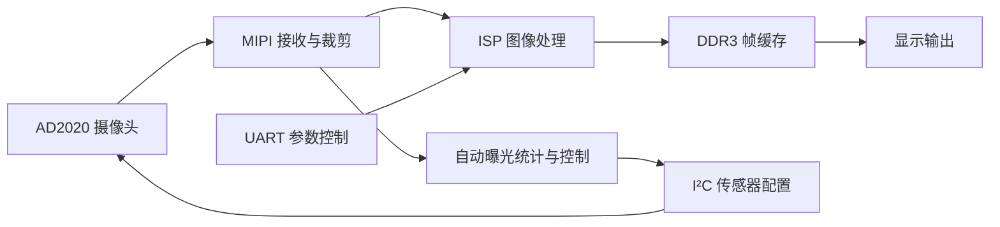

# Ti60_Demo · FPGA 图像采集与 ISP 显示

基于 **Efinix Titanium Ti60F225** 的 Verilog 工程，包含摄像头配置、MIPI 接收、图像处理、DDR3 帧缓存和显示输出。适合阅读 FPGA 视频数据通路、ISP 算法和跨时钟域接口实现。

当前顶层使用 AD2020 配置模块，输入尺寸参数为 1280×960，裁剪目标为 1280×720。仓库还保留其他传感器和显示接口的实现；具体启用路径以 `example_top.v` 为准。文档中的 720P60 等项目目标不等同于本次整理的实测结果。

**状态：源码整理版。** 已检查工程引用文件；尚未在本次整理中完成 Efinity 综合、时序收敛和上板验证。第三方代码的再分发依据仍需补齐，见 [第三方说明](THIRD_PARTY_NOTICES.md)。

## 数据通路



代码包含 Bayer 转 RGB、AE、AWB、色彩空间转换、降噪、坏点处理、锐化、Gamma 和高光抑制相关模块。模块的连接、旁路和处理顺序请查看顶层，不能仅凭目录判断是否已启用。

## 环境与构建

| 项目 | 配置 |
| --- | --- |
| FPGA | Titanium Ti60F225，C4 时序模型 |
| 工程记录的工具版本 | Efinity 2025.1.110.2.15 |
| 工程 / 顶层 | `Ti60_Demo.xml` / `example_top` |
| 物理接口 / 时序约束 | `Ti60_Demo.peri.xml` / `Ti60_Demo.pt.sdc` |
| IP | `ip/` 中的 Efinity 生成文件与 `settings.json` |

1. 安装适用于该器件的 Efinity，使用工程记录版本作为复现起点。
2. 在 Efinity 中打开根目录的 `Ti60_Demo.xml`，检查 IP 状态、器件、时钟和引脚配置。
3. 运行综合、布局布线、时序分析与 bitstream 生成。换用其他开发板时，应根据原理图重新核对接口、电压和约束。
4. 使用生成的 bitstream 上板，逐项验证传感器初始化、视频输出、串口调参和曝光反馈。

Windows 命令行也可使用以下入口（路径替换为自己的安装目录）：

```powershell
$env:EFINITY_HOME = 'C:\efinity\2025.1'
.\start.cmd
```

也可以将 Efinity 的 `bin` 加入 `PATH`。脚本从项目目录启动构建并返回工具退出码，不再依赖 WSL 或自动删除输出。`ip/DdrCtrl/ddr3_controller.bin` 是 IP 所带数据文件，不能按普通编译产物删除。

无需 Efinity 的文件完整性检查（Python 3.10+，仅标准库）：

```powershell
python scripts/check_project.py
```

此检查覆盖 XML 中的源文件、约束、IP 配置、IP 源文件、include 目录和 Git 跟踪状态，不替代 HDL 编译或仿真。

## 目录导航

| 路径 | 内容 |
| --- | --- |
| `example_top.v` | 系统集成与实际数据通路 |
| `src/cmos_i2c/` | 传感器配置与 I²C |
| `src/isp/` | 图像处理与 AE/AWB |
| `src/axi/`、`src/ddr_rw_ctrl.v` | 存储访问控制 |
| `src/data_in_uart/` | 串口控制；96 MHz 时钟下分频参数对应约 115200 bps |
| `src/hdmi_ip/`、`src/dsi/`、`src/lvds/` | 显示接口 |
| `ip/` | 厂商 IP、生成参数和示例 |
| `test/` | 历史仿真文件，见 [测试说明](test/README.md) |
| `doc/` | [文档索引](doc/README.md) |
| `scripts/` | 工程完整性检查 |

保留原有 RTL 目录和文件名，以减少工程路径变更。未列入 XML 的文件可能是旧版、备选实现或测试文件；不要递归把全部 `.v` 加入综合，否则可能引入同名模块和 testbench。

## 已知限制

- 历史 AE 集成示例依赖缺失的 `i2c_realtime_writer.v`；原工程还引用了不存在的 `i2c_timing_ctrl_16bit_sp.v`。这两个缺失引用及未被顶层实例化的集成示例已从综合清单移除，示例源码保留供参考，不能直接用于复现。
- 原工程中 I²C、锐化和 DPC 的三个失效路径已指向仓库内现有文件。是否存在其他 HDL 接口或时序问题仍需 Efinity 验证。
- 现有测试不是完整的自动回归；尚未提供可验证的整机帧率、延迟、资源占用或时序报告。
- 引脚约束与具体硬件绑定；原理图、接线照片及完整上板复现记录尚未随整理版补齐。

## 许可证与贡献

项目维护者拥有权利的原创部分采用 [MIT License](LICENSE)。**第三方源码、厂商 IP、模型和衍生部分不因根目录 MIT 而改变许可。** 原始版权和作者声明均保留，详见 [THIRD_PARTY_NOTICES.md](THIRD_PARTY_NOTICES.md)。

修改和问题反馈见 [贡献说明](CONTRIBUTING.md)。首次公开发布前请处理 [发布准备记录](doc/RELEASE_PREPARATION.md) 中的未完成项。
