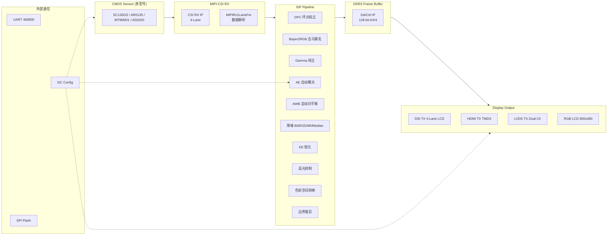
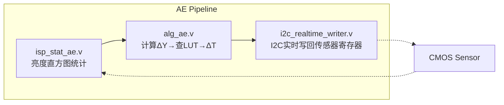
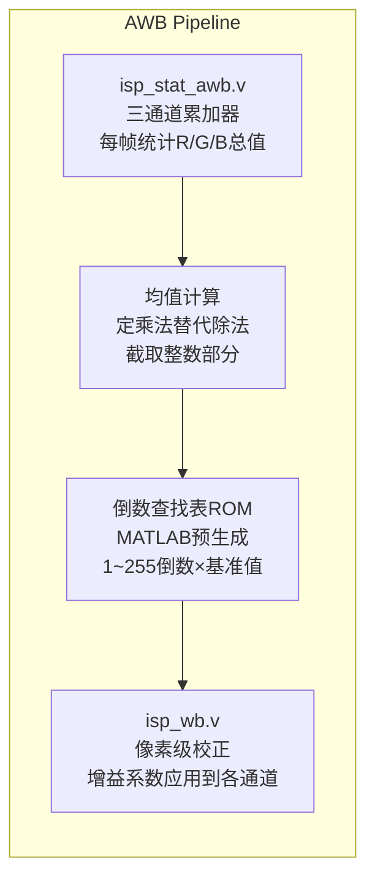
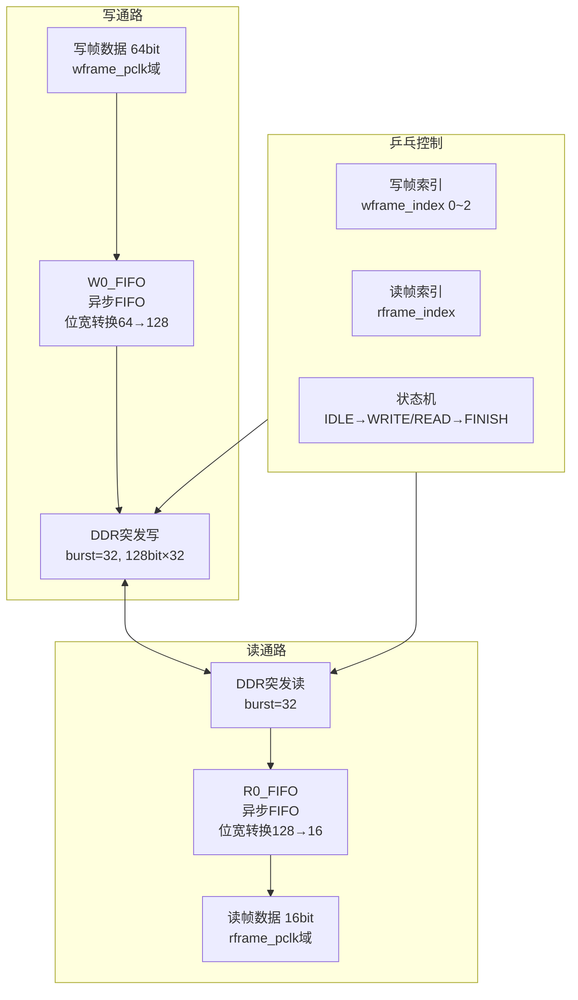
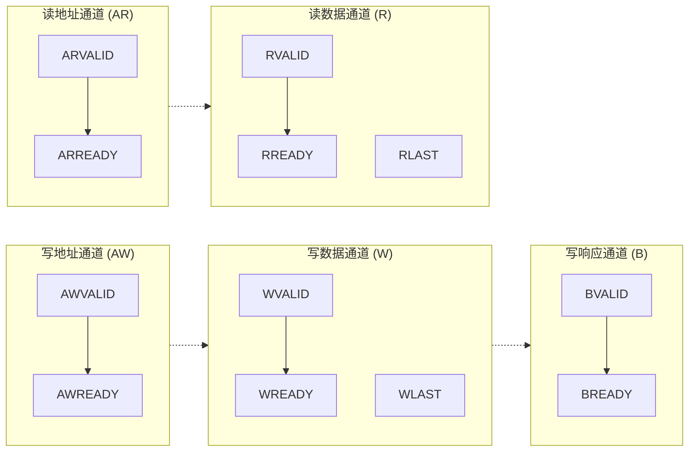
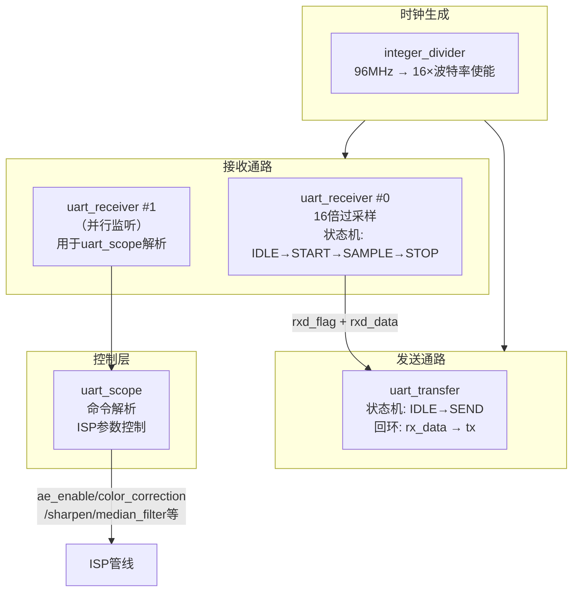
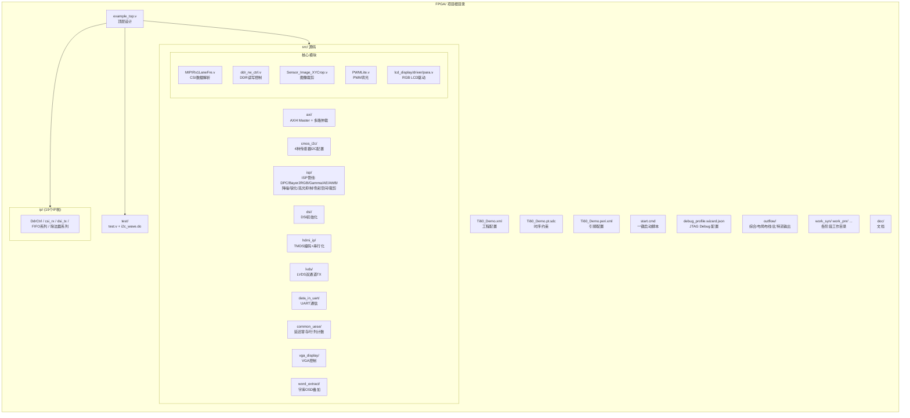

# Ti60_Demo FPGA 图像处理与显示系统 —— 项目介绍书

## 目录

- [1. 项目概述](#1-项目概述)
- [2. 系统架构总览](#2-系统架构总览)
- [3. 时钟与复位管理](#3-时钟与复位管理)
- [4. 核心模块详解](#4-核心模块详解)
  - [4.1 MIPI-CSI 接收与 CMOS 传感器配置](#41-mipi-csi-接收与-cmos-传感器配置)
  - [4.2 ISP 图像处理管线](#42-isp-图像处理管线)
    - [4.2.0 低延迟设计原则](#420-低延迟设计原则面试常考)
    - [4.2.1 Bayer 阵列与去马赛克](#421-bayer-阵列与去马赛克bayer2rgb)
    - [4.2.2 自动曝光（AE）](#422-自动曝光ae)
    - [4.2.3 自动白平衡（AWB）](#423-自动白平衡awb)
    - [4.2.4 消光 / 高光抑制](#424-消光--高光抑制highlight-reduction)
    - [4.2.5 图像降噪](#425-图像降噪)
    - [4.2.6 锐化与清晰度增强](#426-锐化与清晰度增强)
    - [4.2.7 Gamma 校正](#427-gamma-校正)
    - [4.2.8 色彩空间转换](#428-色彩空间转换)
    - [4.2.9 进阶优化方向](#429-进阶优化方向竞赛指标-3)
  - [4.3 DDR3 存储控制器](#43-ddr3-存储控制器)
  - [4.4 AXI4 总线协议详解](#44-axi4-总线协议详解)
  - [4.5 多路显示输出](#45-多路显示输出)
  - [4.6 UART 通信协议详解](#46-uart-通信协议详解)
- [5. IP 核组件清单](#5-ip-核组件清单)
- [6. 技术亮点](#6-技术亮点)
- [7. 设计约束与后端流程](#7-设计约束与后端流程)
- [8. 项目文件结构](#8-项目文件结构)
- [9. 项目总结](#9-项目总结)
- [10. 附录：FIFO 缓冲与跨时钟域设计](#10-附录fifo-缓冲与跨时钟域设计面试重点)
  - [10.1 FIFO 基础概念](#101-fifo-基础概念)
  - [10.2 异步 FIFO 设计原理](#102-异步-fifo-设计原理面试必考)
  - [10.3 多 bit 信号跨时钟域方法比较](#103-补充多-bit-信号跨时钟域的方法比较)

---

## 1. 项目概述

本项目是一个基于 **Efinix Titanium Ti60F225** FPGA 平台实现的完整图像采集、处理与多路显示系统。系统从 CMOS 图像传感器采集原始视频数据，经过 MIPI-CSI 接收、ISP（图像信号处理）管线处理、DDR3 帧缓存，最终通过 MIPI-DSI、HDMI、LVDS、RGB LCD 等多种接口输出到显示设备。

| 项目属性 | 详情 |
|----------|------|
| FPGA 平台 | Efinix Titanium Ti60F225 (C4 时序模型) |
| 开发工具 | Efinity 2025.1.110.2.15 |
| 设计语言 | Verilog (Verilog-2001/2005) |
| 顶层模块 | `example_top` |
| 项目名称 | Ti60_Demo |
| 核心频率 | Sys: 96MHz, Pixel: 74.25MHz, DDR: 200MHz |
| 支持分辨率 | 多种（640×480 / 1280×720 / 1280×960 / 1280×1024） |

## 2. 系统架构总览



## 3. 时钟与复位管理

系统包含多个独立 PLL，管理跨时钟域的多路复位信号同步：

| 时钟域 | 频率 | 用途 |
|--------|------|------|
| `clk_sys` | 96MHz | 系统主时钟 |
| `clk_pixel` | 74.25MHz | 像素处理时钟 |
| `clk_pixel_2x` | 148.5MHz | HDMI/LVDS 2倍频 |
| `clk_pixel_10x` | 742.5MHz | HDMI 串行化 |
| `core_clk` | 200MHz | DDR3 控制器核心时钟 |
| `dsi_refclk_i` | 48MHz | DSI 参考时钟 |
| `dsi_byteclk_i` | - | DSI 字节时钟 |
| `clk_lvds_1x` | - | LVDS 1倍频 |
| `clk_27m` / `clk_54m` | 27/54MHz | 视频时钟 |

所有 PLL 锁定信号（`sys_pll_lock`, `dsi_pll_lock`, `ddr_pll_lock`, `lvds_pll_lock`）做"与"后作为全局就绪标志，各时钟域的复位信号在各自时钟下做同步释放。

## 4. 核心模块详解

### 4.1 MIPI-CSI 接收与 CMOS 传感器配置

- **MIPI-CSI RX**: 使用 Efinix `csi_rx` IP 核，支持 4 条数据通道（RXD0–RXD3），含 HS/LP 模式切换和终端使能控制。
- **MIPI 数据解析**: `MIPIRx1LaneFre.v`（由 Yosys 生成），负责从 CSI 字节流中解析出帧同步（VSYNC）、行同步（HSYNC）、数据有效（DE）和像素数据（DAT）。
- **I2C 传感器配置**: 支持多种 CMOS 传感器，通过 I2C 寄存器表初始化：
  - **SC130GS** (1280×1024, 4 Lanes) — `I2C_SC130GS_12801024_4Lanes_Config.v`
  - **AR0135** (1280×720) — `I2C_AR0135_1280720_Config.v`
  - **MT9M001** (灰度) — `I2C_MT9M001_Gray_Config.v`
  - **AD2020** (1280×960, FPS60, 1 Lane) — `I2C_AD2020_1280960_FPS60_1Lane_Config.v`
- **I2C 时序控制**: 提供 `i2c_timing_ctrl_16bit`、`i2c_timing_ctrl_reg16_dat16`、`i2c_timing_ctrl_reg16_dat8_wronly` 三种控制器，分别对应不同寄存器地址/数据位宽组合。
- **RAW 灰度采集**: `CMOS_Capture_RAW_Gray.v` 支持直接从传感器获取 RAW 灰度数据。

### 4.2 ISP 图像处理管线

完整的 ISP 流水线，实现对原始 Bayer 数据的实时处理。内窥镜相机系统由摄像头、光源和图像处理单元组成，医疗内窥镜对**图像清晰度、色彩还原和实时性**要求极高，工业内窥镜则对**环境适应性**要求更高。

#### 4.2.0 低延迟设计原则（面试常考）

内窥镜 ISP 的一个**系统级约束**是低延迟——所有图像处理必须**以行为单位**，而不是以帧为单位：

```
帧级处理：缓存完整一帧 → 处理 → 输出    延迟 = 1 帧（~16.7ms@60fps）
行级处理：缓存若干行 → 逐行处理 → 输出  延迟 = 若干行（~几十μs）

FPGA 实现的核心策略：
  - 使用 Line Buffer（FIFO/BRAM）缓存 2~5 行数据即可开始处理
  - 行场信号与像素数据同步打拍，保证输出对齐
```

#### 4.2.1 Bayer 阵列与去马赛克（Bayer2RGB）

**拜耳阵列原理**：

CMOS 图像传感器只能感知光强而不能感知波长，因此在前方设置彩色滤光片阵列（Color Filter Array, CFA），每个像素只记录一种颜色。人眼对绿色更敏感，因此 G 通道占 1/2 像素，R 和 B 各占 1/4：

```
Bayer Pattern (RGGB):
  R  G  R  G  R  G ...
  G  B  G  B  G  B ...
  R  G  R  G  R  G ...
  G  B  G  B  G  B ...

每个 2×2 块包含：2个G + 1个R + 1个B
```

**双线性插值法（Bilinear Interpolation）**：

这是最基础的 Bayer2RGB 算法，通过相邻像素平均值估算缺失的颜色值：

| 目标像素位置 | 缺失通道 | 插值方法 |
|-------------|---------|---------|
| 非绿色点 → G | 绿色 | (上 + 下 + 左 + 右) / 4，例：G8 = (G3+G7+G9+G13)/4 |
| 绿色点 → R/B | 红/蓝 | 相邻两同色像素均值，例：B7 = (B6+B8)/2，R7 = (R2+R12)/2 |
| 红色点 → B | 蓝色 | 四角同色像素均值，例：R8 = (R2+R4+R12+R14)/4 |

**FPGA 实现**：缓存 2 行数据（Line Buffer FIFO），加上当前输入行共 3 行，构成 3×3 滑动窗口。除以 2 和除以 4 分别用右移 1 位和 2 位实现。

双线性插值实现简单，但仅使用邻近像素均值，容易导致边缘模糊或色彩伪影。进阶算法如**梯度校正线性插值**（Gradient-Corrected Linear Interpolation）会考虑邻域色彩梯度，根据梯度对插值结果做补偿——这也是本项目 `VIP_RAW8_RGB888.v` 采用的策略，内置 3×3 矩阵生成和双行缓冲。

#### 4.2.2 自动曝光（AE）

**基本原理**：

曝光量 = 光圈 × 快门时间 × ISO（传感器增益）。在固定光圈的内窥镜场景下，通过调节曝光时间和增益来控制图像亮度。AE 的核心目标是让图像亮度稳定在目标值，要求**快速响应**和**快速收敛**。

**灰度均值法**（本项目基础实现）：

计算整幅图像的灰度均值 Y，与目标亮度 Yt 比较得到差值 ΔY = Yt − Y，再通过查表（LUT）获取调整步长 ΔT，下一帧曝光时间 Tn = T + ΔT：

```
当 |ΔY| ≤ ΔYmin → AE 已收敛，无需调整
当 |ΔY| > ΔYmin → 计算 ΔT，更新曝光时间
```

**加权灰度均值法**：

将图像分为 N 个区域，每个区域单独计算灰度均值后加权求和。在医疗内窥场景中，**图像中央区域权重大于边缘**，因为医生关注的病灶通常位于画面中心。

**直方图法**（进阶优化）：

均值法在背景色彩单一场景下容易误判（全白背景导致欠曝、全黑背景导致过曝）。直方图法统计整个亮度范围的像素分布，通过分析直方图形状来决定曝光策略，对极端场景的适应性更强。

**灰度转换公式**：

```
Y = 0.299R + 0.587G + 0.114B

FPGA 定点化：等式两边 × 256
Y = (77R + 150G + 29B) >> 8

0.299×256≈77, 0.587×256≈150, 0.114×256≈29
```

这种方式避免了浮点数运算，整个亮度统计只需乘法器和累加器。

**本项目 FPGA 实现流程**：



#### 4.2.3 自动白平衡（AWB）

**为什么需要 AWB**：

传感器无法像人眼一样根据环境光变化而改变感光特性——人眼在日光下看到的白纸和在钨丝灯下看到的白纸都是白色的，但传感器在后者会偏黄。AWB 的目标是将不同色温环境光下的白色还原为真正的白色。

**灰度世界法（Gray World）**（本项目基础实现）：

核心假设：自然场景中所有颜色的平均反射光应趋近于中性灰，即 R、G、B 三通道的**均值应大致相等**：

```
1. 统计各通道总值 → 计算 R、G、B 各通道均值
2. 确定基准值：通常将 G 通道均值作为基准（即 G 增益固定为 1）
3. 计算增益：R_gain = G均值 / R均值，B_gain = G均值 / B均值
4. 每个像素 × 对应增益系数 → 校正后输出
5. 超出 [0, 255] 范围时做 Clamp 饱和处理
```

**进阶优化（如白点检测/完美反射法）**：

基础的灰度世界法在面对大面积单色背景（如整面红墙）时容易产生严重偏色。进阶算法会先进行“白点检测”，只统计图像中那些有可能是白色的像素，利用这些特定像素来计算增益，对复杂光照场景适应性更强。

**本项目 FPGA 实现**：



#### 4.2.4 消光 / 高光抑制（Highlight Reduction）

**应用背景**：

在医疗内窥场景中，光源照射到器官表面液体或湿润组织会产生强烈反光，导致局部区域"一片白"，丢失组织细节。消光处理的目的是检测并压制这些高光区域。

**算法原理**：

```
Step 1 — 高光检测：
  - 亮度判断：像素亮度 Y > 阈值 Th_high → 候选高光点
  - 饱和度判断：高光区域通常饱和度低
  - HSV 颜色空间中，V = max(R,G,B)，饱和度 S = (V-min)/V

Step 2 — 亮度压缩：
  - 对判定为高光的像素，通过亮度映射曲线（Gamma/Log/S型）降低亮度
  - FPGA 实现方式：预计算 LUT 查表

Step 3 — 纹理补偿：
  - 用高光区域周围的正常像素进行插值，恢复纹理信息
  - 可使用 3×3 中值滤波 或 双边滤波
```

**HSV 颜色空间**：

HSV（Hue 色相 / Saturation 饱和度 / Value 亮度）比 RGB 更贴近人类对颜色的感知。在 FPGA 中，V = max(R,G,B) 取最大值即可，比 RGB→Y 的加权和更简单。

#### 4.2.5 图像降噪

**2D 降噪 vs 3D 降噪**：

| 类型 | 原理 | 帧间关联 | 资源消耗 | 效果 |
|------|------|---------|---------|------|
| 2D NR | 单帧内空域滤波 | 无 | 低 | 中等，可能损失细节 |
| 3D NR | 多帧时域+空域联合 | 有 | 高（需帧缓存） | 好，保留细节 |

本项目的 ISP 管线同时包含 2DNR 和 BNR（Bayer 域降噪），覆盖两种策略。

**三种常见空域滤波器对比**：

| 滤波类型 | 原理 | 优点 | 缺点 | 本项目模块 |
|---------|------|------|------|----------|
| 均值滤波 | 邻域像素取平均值替换中心像素 | 计算简单、实时性高 | 模糊边缘、对椒盐噪声差 | — |
| 中值滤波 | 邻域像素排序取中值替换中心 | 有效抑制椒盐噪声、保留边缘 | 计算量大（需排序） | `vip_gray_median_filter.v` |
| 高斯滤波 | 按高斯分布加权平均 | 平滑效果好、保留边缘过渡 | 对椒盐噪声不敏感 | `isp_bnr.v` |

**3×3 矩阵生成（Line Buffer 架构）**——面试高频考点：

几乎所有空域滤波都需要 3×3 滑动窗口。在数据按行输入的情况下，FPGA 的核心挑战是同时获取 3 行数据：

```
Line Buffer 架构：
  输入 data ──┬──> 第 n 行（当前行）──> 3×3 矩阵生成
              │
              ├──> FIFO1 (1行延迟) ──> 第 n-1 行 ──> 3×3 矩阵生成
              │
              └──> FIFO1 → FIFO2 (再1行延迟) ──> 第 n-2 行 ──> 3×3 矩阵生成

  两个 FIFO 级联，每个 FIFO 深度 = 一行像素数
  每个时钟周期：3 个像素同时输出 → 组成 3×3 矩阵中的一列
  配合移位寄存器（3个寄存器打拍）→ 完整 3×3 窗口
```

**FPGA 实现要点**：

```
1. FIFO 深度 = 图像宽度 - 3（因为前 2 个像素还没填满窗口）
2. 行场信号需要同步打拍，打拍数 = Line Buffer 延迟 + 滤波计算延迟
3. 图像边界处理：前 2 行和每行前 2 列无法组成完整 3×3 窗口
   常见策略：边界镜像 / 补零 / 边界复制
```

**均值滤波示例**：

```
3x3 窗口：
  [197  25 106]
  [107  40 107]  →  均值 = (197+25+106+107+40+107+163+149+71)/9
  [163 149  71]       = 965/9 ≈ 107

中心像素由 40 被替换为 107，窗口滑动 → 逐行逐列 → 整图完成
```

#### 4.2.6 锐化与清晰度增强

**清晰度的本质**：

清晰度增强 = 在边缘亮侧叠加白色渐变条 + 在边缘暗侧叠加黑色渐变条，从而让物体轮廓和细节纹理更加清晰。与降噪相反——降噪是平滑、锐化是增强差异。

**本项目实现**：`isp_ee.v`（Edge Enhancement），通过检测邻域亮度梯度，对边缘两侧做加减操作实现边缘增强。

#### 4.2.7 Gamma 校正

Gamma 校正是非线性亮度映射，补偿显示器与人眼之间的非线性响应关系。FPGA 实现方式：预计算 256 级 LUT ROM，输入像素值直接查表输出。

#### 4.2.8 色彩空间转换

| 转换 | 方向 | 模块 |
|------|------|------|
| RGB → YCbCr | 亮度/色度分离（用于后续处理） | `rgb2ycbcr.v` |
| YUV → RGB | 恢复 RGB（用于显示输出） | `vip_yuv2rgb.v` |

Y 通道对应亮度（用于 AE 统计），Cb/Cr 对应蓝色/红色色度分量。

#### 4.2.9 进阶优化方向（竞赛指标 3）

参考同类内窥镜 ISP 项目的优化思路：

1. **Bayer2RGB 升级**：从双线性插值 → 梯度校正线性插值，根据邻域色彩梯度补偿插值结果，减少边缘伪影
2. **AE 升级**：从灰度均值法 → 直方图法，解决单一背景色场景的误判问题
3. **AWB 升级**：从灰度世界法 → 动态阈值法，根据图像统计特性自适应计算阈值
4. **消光增强**：AE 快速收敛 + HDR 多曝光合成，在 ISP 链路前端降低反光影响
5. **图像缩放**：最近邻（简单但有锯齿）→ 双线性（平滑）→ 双三次（最佳但硬件复杂），按需求选择
6. **直方图均衡化**：调整图像直方图分布，改善整体对比度和局部对比度，提升暗部细节可视性

**图像缩放算法对比**：

| 算法 | 原理 | 硬件实现 | 效果 |
|------|------|---------|------|
| 最近邻 | 直接取最近的像素值 | 最简单（截断取值） | 有锯齿 |
| 双线性 | 周围 4 像素按距离加权 | 中等（4次乘法+加法） | 平滑 |
| 双三次 | 周围 16 像素三次多项式插值 | 复杂（16次乘法） | 最佳 |

### 4.3 DDR3 存储控制器

#### 4.3.1 DDR3 基础知识

DDR3（Double Data Rate 3）是第三代双倍数据率同步动态随机存取存储器。核心特征：

- **双倍数据率**：在时钟的上升沿和下降沿各传输一次数据，等效数据速率是时钟频率的 2 倍
- **8n 预取架构**：每个内存访问周期内部预取 8 个数据字，DDR3 核心频率 = 数据速率 / 8
- **工作电压**：1.5V（DDR3L 为 1.35V），相比 DDR2 的 1.8V 功耗更低
- **Bank 结构**：8 个内部 Bank，通过 Bank 交织提高访问效率

**DDR3 关键时序参数**：

| 参数 | 含义 | 典型值（DDR3-1600） |
|------|------|---------------------|
| tRCD | RAS 到 CAS 延迟 | 13.75 ns |
| tCL (CAS Latency) | 读命令到数据输出的延迟 | 11 个时钟周期 |
| tRP | 预充电周期 | 13.75 ns |
| tRAS | 行激活到预充电最小时间 | 35 ns |
| tRC | 同一 Bank 行周期（tRAS + tRP） | 48.75 ns |
| tRFC | 刷新周期 | 260 ns |
| tWR | 写恢复时间 | 15 ns |

**DDR3 命令真值表**（RAS/CAS/WE 组合定义操作）：

| 命令 | RAS | CAS | WE |
|------|-----|-----|-----|
| 行激活 (ACT) | 0 | 1 | 1 |
| 读 (RD) | 0 | 0 | 1 |
| 写 (WR) | 0 | 1 | 0 |
| 预充电 (PRE) | 0 | 0 | 0 |
| 刷新 (REF) | 1 | 1 | 0 |
| NOP | 1 | 1 | 1 |

#### 4.3.2 项目中 DDR3 控制器的实现

项目使用 Efinix `DdrCtrl` IP 核，接口包含完整的 DDR3 PHY 信号：

```
DDR3 PHY 接口：DQ[15:0]（数据）、DQS（数据选通）、DM（数据掩码）、
              ADDR[15:0]（行列地址）、BA[2:0]（Bank 地址）、
              CK/CK#（差分时钟）、CKE（时钟使能）、CS（片选）、
              RAS/CAS/WE（命令）、ODT（片内终端电阻）
```

**ddr_rw_ctrl 乒乓缓冲架构**（`src/ddr_rw_ctrl.v`）：



核心设计要点：

1. **乒乓缓冲**：使用 3 个帧缓冲区（wframe_index 循环 0→1→2→0），写指针领先读指针至少 1 帧，避免同时读写同一缓冲区
2. **VSYNC 触发**：下降沿检测 VSYNC 作为帧结束标志（EOF），触发 FIFO 复位和指针更新
3. **读/写仲裁**：状态机 IDLE 状态下，写 FIFO 数据满 32 个（C_BURST_LEN）优先写 DDR；否则若读 FIFO 未满则发起 DDR 读
4. **突发控制**：每次读写突发 32 个 128-bit 数据 = 512 bytes/burst

**axi4_ctrl 四缓冲调度器**（`src/axi/axi4_ctrl.v`）：

相比 ddr_rw_ctrl 的 3 缓冲，axi4_ctrl 使用 **4 个缓冲区**实现更安全的读写隔离：

```
写指针递增规则：
  next_ptr = (wr_ptr + 1 == rd_ptr) ? wr_ptr + 2 : wr_ptr + 1
  即：写指针永远不会追上读指针，至少保持 1 个缓冲区的安全距离
```

这保证了在极端情况下（读写速率不匹配时），不会发生数据覆盖或读取空数据。

### 4.4 AXI4 总线协议详解

#### 4.4.1 AXI4 协议基础

AXI4（Advanced eXtensible Interface 4）是 ARM 公司定义的高性能片内总线协议，是 FPGA 系统中连接 IP 核的标准总线。

**5 个独立通道**：



**VALID/READY 握手机制**：

```
规则：VALID 和 READY 同时为高时，数据传输发生
规则：VALID 一旦拉高，必须保持到 READY 握手完成
规则：READY 可以在 VALID 之前拉高，也可以等待 VALID 后拉高
规则：不同通道之间的 VALID/READY 没有依赖关系（写数据可以在写地址之前）
```

**AXI4 突发类型**：

| 类型 | 编码 | 描述 |
|------|------|------|
| FIXED | 2'b00 | 固定地址，每次传输使用相同地址（FIFO 类访问） |
| INCR | 2'b01 | 递增地址，每次传输地址递增（本项目使用） |
| WRAP | 2'b10 | 回绕地址，到达边界后回绕到起始地址（Cache 行填充） |

**AXI4 信号分类**（以本项目 128-bit 位宽为例）：

| 信号组 | 信号 | 位宽 | 说明 |
|--------|------|------|------|
| 写地址 | awid | 8 | 写事务 ID |
| | awaddr | 32 | 写起始地址 |
| | awlen | 8 | 突发长度 - 1（本项目=127） |
| | awsize | 3 | 每 beat 字节数编码（本项目=4 → 16 bytes/beat） |
| | awburst | 2 | 突发类型（本项目=INCR） |
| | awvalid/awready | 1 | 握手 |
| 写数据 | wdata | 128 | 写数据 |
| | wstrb | 16 | 字节使能（每 bit 对应 1 byte） |
| | wlast | 1 | 最后一 beat |
| | wvalid/wready | 1 | 握手 |
| 写响应 | bresp | 2 | 写响应状态 |
| | bvalid/bready | 1 | 握手 |
| 读地址 | arid/araddr/arlen/arsize/arburst | — | 与写地址结构相同 |
| 读数据 | rdata | 128 | 读数据 |
| | rresp | 2 | 读响应状态 |
| | rlast | 1 | 最后一 beat |
| | rvalid/rready | 1 | 握手 |

#### 4.4.2 项目中 AXI4 控制器的实现

项目的 `axi4_ctrl.v` 实现了一个**视频帧级 AXI4 Master 控制器**，核心特点：

1. **可参数化设计**：
   - `C_DATA_LEN`：AXI 数据位宽（默认 128-bit）
   - `C_BURST_LEN`：突发长度（默认 128 beats）
   - `C_W_WIDTH / C_R_WIDTH`：用户侧写/读数据位宽（默认 64/8）
   - `C_BUF_SIZE`：缓冲区地址空间（默认 2^22 = 4MB）
   - `C_BASE_ADDR`：基地址（默认 0x00000000）

2. **跨时钟域 FIFO**：
   - 写通道：`wframe_pclk`（像素时钟域）→ `axi_clk`（AXI 时钟域），通过 `W0_FIFO` 系列异步 FIFO 隔离
   - 读通道：`axi_clk` → `rframe_pclk`，通过 `R0_FIFO` 系列异步 FIFO 隔离

3. **帧级调度状态机**（写通道）：

```
IDLE → 检测 FIFO 有数据 → 发起 AXI 写（设置 AWVALID + WVALID）
     → 突发传输中（rc_burst 计数 0~127）
     → WLAST 握手完成 → 地址递增 → 返回 IDLE
     → 检测到 EOF（VSYNC 下降沿）+ FIFO 非空 → 刷新剩余数据
     → EOF 处理 → 复位 FIFO → wframe_index 递增
```

4. **读通道状态机**：

```
IDLE → 读 FIFO 未满 + 地址未越界 → S_READ_ADDR（拉高 ARVALID）
     → S_READ_DATA（等待 ARREADY 握手 + RLAST 完成）
     → 地址递增（每 burst +C_ADDR_INC）→ 返回 IDLE
```

5. **`AXI4_AWARMux.v`**：多路 AXI 主设备仲裁器，允许多个 `axi4_ctrl` 实例共享同一个 DDR3 控制器，通过轮询/优先级仲裁 AXI AW 和 AR 通道。 

### 4.5 多路显示输出

| 接口 | 模块 | 规格 |
|------|------|------|
| **MIPI-DSI TX** | `dsi_tx` IP + `dsi_init.v` | 4-Lane MIPI DSI，支持 LCD 面板初始化配置，含 PWM 背光控制 |
| **HDMI TX** | `hdmi_tx_ip.v` / `rgb2dvi.v` | TMDS 编码 + 10:1 串行化，含 `encode.v`（8b/10b TMDS 编码）、`tmds_channel.v`（单通道 TMDS 差分输出） |
| **LVDS TX** | `LCDDual2LVDS.v` | 双通道 LVDS，RGB 7:1 串行化输出 |
| **RGB LCD** | `lcd_driver.v` / `lcd_display.v` | 并行 RGB888 接口，含 `lcd_para.v` 时序参数、DE-Only 模式、触摸屏 I2C、SPI 闪存烧录通道复用 |

### 4.6 UART 通信协议详解

#### 4.6.1 UART 协议基础

UART（Universal Asynchronous Receiver/Transmitter）是最常用的异步串行通信协议。

**帧格式**（以本项目 460800-8-N-1 为例）：

```
空闲    起始位    D0    D1    D2    D3    D4    D5    D6    D7    停止位   空闲
─────┐         ┌─────────────────────────────────────────────────────┐         ┌─────
     │         │                                                     │         │
     └─────────┘                                                     └─────────┘
     1 bit     <-------------------- 8 data bits ----------------->   1 bit
     (低电平)   LSB first                                           (高电平)
```

| 参数 | 含义 | 本项目配置 |
|------|------|-----------|
| 波特率 | 每秒传输的符号数 | 460800 / 115200 bps |
| 数据位 | 每个帧的数据 bit 数 | 8 |
| 校验位 | 数据后跟随的校验位 | N（无校验） |
| 停止位 | 帧结束标志 | 1 |
| 电平标准 | 空闲电平 | 高电平（1） |
| 起始位 | 帧开始标志 | 低电平（0），持续 1 bit 时间 |

**波特率与 bit 时间计算**：

```
1 bit 时间 = 1 / 波特率
460800 bps → 1 bit ≈ 2.17 μs
115200 bps → 1 bit ≈ 8.68 μs

96MHz 时钟下每个 bit 的时钟周期数：
460800 bps: 96,000,000 / 460,800 ≈ 208.3 周期
115200 bps: 96,000,000 / 115,200 ≈ 833.3 周期
```

#### 4.6.2 16 倍过采样原理

本项目采用 **16 倍波特率过采样** 技术，这是 UART 接收中最关键的设计决策：

```
每个 bit 时间内采样 16 次

───────┐         ┌─────────────────────────────────────────
       │         │
       └─────────┘
       ^    ^                                            ^
       │    │                                            │
   检测到   在采样中心点(smp_cnt==7)采样      在 smp_cnt==15 时
   下降沿   确保在 bit 最稳定的位置采样       bit 周期结束
```

**为什么选 16 倍**：

1. **起始位下降沿检测**：在 IDLE 状态检测 rxd 的下降沿，进入 START 状态
2. **采样中心点对齐**：在 smp_cnt==7（16 个中的中间位置）时采样数据，此时信号最稳定，避免在跳变沿附近采样
3. **起始位验证**：在 smp_cnt==7 时再次检查 rxd 是否为低电平，若不是则判定为毛刺干扰，回到 IDLE
4. **累计误差容忍**：收发双方时钟频率允许一定偏差。16 倍采样下，在一个字节（10 bit）传输中最大累计偏差 < 1/2 bit 即可正确接收

**容错分析**：

```
一个完整帧 = 1 起始 + 8 数据 + 1 停止 = 10 bits
采样点在 bit 中心 → 允许的最大时钟偏差：
  偏差 * 10 bits < 0.5 bit 时间
  最大偏差 < 5%
  
对于 460800 bps @ 96MHz:
  理论分频值 = 96,000,000 / (460800 × 16) ≈ 13.02
  实际取整 = 13
  实际波特率 = 96,000,000 / (13 × 16) ≈ 461538 bps
  偏差 = (461538 - 460800) / 460800 ≈ 0.16%  ← 远小于 5%, 安全
```

#### 4.6.3 项目中 UART 的实现

**整体架构**（`src/data_in_uart/uart_control_top.v`）：



**integer_divider 分频器**（`src/data_in_uart/integer_divider.v`）：

```verilog
// 核心逻辑：产生 16×波特率的脉冲使能信号
parameter DEVIDE_CNT = 52;  // 115200bps × 16 @ 96MHz
                            // 96,000,000 / (115200 × 16) ≈ 52.08

reg [31:0] cnt;
always @(posedge clk or negedge rst_n) begin
    if(!rst_n)
        cnt <= 0;
    else
        cnt <= (cnt < DEVIDE_CNT - 1) ? cnt + 1 : 0;
end
assign divide_clken = (cnt == DEVIDE_CNT - 1) ? 1 : 0;
```

**uart_receiver 接收状态机**（`src/data_in_uart/uart_receiver.v`）：

```
状态转换图：
                    rxd=0 (检测到起始位)
    R_IDLE ───────────────────────────> R_START
      ^                                    │
      │                          smp_cnt==7 │
      │                    ┌────────────────┤
      │                    │ rxd≠0?  (毛刺)  │
      │                    │ 回 R_IDLE       │ smp_cnt==15 (起始位结束)
      │                    └────────────────┤
      │                                     v
      │                                 R_SAMPLE
      │                    smp_cnt==15       │
      │              ┌──── rxd_cnt==8 ──────┤
      │              │  (8bit采样完毕)       │ smp_cnt==15 (继续采样)
      │              v                      │
      │          R_STOP                     │
      │              │                      │
      │     smp_cnt==15│                     │
      └───────────────┘                     │
          (返回IDLE)                        │
                                            │
                            在每个 smp_cnt==7 的中心点：
                            rxd_data[0] ← rxd_sync (rxd_cnt==1)
                            rxd_data[1] ← rxd_sync (rxd_cnt==2)
                            ...
                            rxd_data[7] ← rxd_sync (rxd_cnt==8)
```

**uart_transfer 发送状态机**（`src/data_in_uart/uart_transfer.v`）：

```
    txd_en=1
T_IDLE ──────> T_SEND
  ^               │
  │    smp_cnt=15 │
  │   txd_cnt==9  │
  └───────────────┘

组合逻辑编码 txd 输出：
  txd_cnt==0 → txd=0 (起始位)
  txd_cnt==1 → txd=txd_data[0]
  txd_cnt==2 → txd=txd_data[1]
  ...
  txd_cnt==8 → txd=txd_data[7]
  txd_cnt==9 → txd=1 (停止位)
  default    → txd=1 (空闲态高电平)
```

**数据流**：PC → UART_RX → rxd_data → uart_transfer（回环）→ UART_TX → PC。同时 uart_receiver_1 并行监听，将接收数据送入 uart_scope 解析为 ISP 控制命令（AE 使能、色彩校正使能、中值滤波使能、消光使能、锐化使能、缩放等级等）。

#### 4.6.4 面试常考要点

**Q: 为什么用 16 倍过采样而不是在波特率频率直接采样？**
A: (1) 16 倍采样允许在 bit 中心点（第 7-8 个采样脉冲）采样，避开跳变沿，抗干扰性强；(2) 能容忍收发时钟频率偏差（最高约 5%）；(3) 16 倍过采样是 UART 行业标准做法（还有 8 倍、13 倍等变体）。

**Q: 如何处理起始位的毛刺误触发？**
A: 在 START 状态的 smp_cnt==7（半 bit 位置）再次检查 rxd 是否为低电平。若已恢复为高，则判断为毛刺，返回 IDLE 状态。

**Q: `integer_divider` 产生的不是真正的时钟，而是 `divide_clken` 使能脉冲，两者有何区别？**
A: 在 FPGA 设计中，应避免用逻辑生成时钟（会产生时钟偏斜、布线不确定性）。正确做法是使用系统时钟，生成一个周期的使能脉冲作为"门控"信号。这是 FPGA 低功耗/多速率设计的标准范式。

## 5. IP 核组件清单

| IP 核 | 功能 | 规格 |
|-------|------|------|
| `DdrCtrl` | DDR3 存储控制器 | 128-bit AXI 数据接口 |
| `csi_rx` | MIPI-CSI 接收器 | 4-Lane, 8-bit per lane |
| `dsi_tx` | MIPI-DSI 发送器 | 4-Lane |
| `W0_FIFO` 系列 | 写入 FIFO | 多种位宽 (8/32/64) |
| `R0_FIFO` 系列 | 读取 FIFO | 多种位宽 (8/16/32) |
| `W8R8_D2048_YUV` | 双端口 FIFO | 8-bit 写入/8-bit 读取, 2048 深度 |
| `FIFO_W48R24` | 跨位宽 FIFO | 48-bit 写入, 24-bit 读取 |
| `afifo_w24d16_r24d16` | 同步位宽 FIFO | 24-bit, 16 深度 |
| `afifo_w32r8_reshape` | 跨位宽异步 FIFO | 32-bit 写, 8-bit 读 |
| `div_u*_u*` | 除法器 IP | 多种位宽（26/10, 27/21, 29/21, 39/31） |

## 6. 技术亮点

### 6.1 多时钟域设计
项目中包含 8+ 个独立时钟域，通过 PLL 锁定级联和独立的同步复位释放逻辑确保了系统的可靠启动。各个处理模块按功能划分时钟域，数据跨时钟域使用异步 FIFO 传递。

### 6.2 实时 AE/AWB 闭环控制
自动曝光和自动白平衡不仅做图像统计，还通过 I2C 实时将计算结果写回 CMOS 传感器寄存器（`i2c_realtime_writer.v`），实现了 **ISP → 统计 → I2C → 传感器** 的完整闭环，无需 CPU 干预。

### 6.3 多传感器兼容架构
通过可配置的 I2C 寄存器表，同一套硬件设计可适配 SC130GS、AR0135、MT9M001、AD2020 四种 CMOS 传感器，仅需切换 `I2C_*_Config.v` 模块例化即可。

### 6.4 多路显示复用
系统同时支持 MIPI-DSI、HDMI、LVDS、RGB LCD 四种显示接口，且 RGB LCD 的数据总线可复用为 SPI Flash 烧录通道，实现了硬件资源的高效利用。

### 6.5 完整的 ISP 管线
自研的 ISP 管线覆盖了从 RAW 数据到 RGB/YUV 输出的完整流程，包含 DPC、去马赛克、Gamma、AE、AWB、降噪（BNR/2DNR/Median）、锐化、高光抑制等模块，达到入门级相机 ISP 的功能完整度。

## 7. 设计约束与后端流程

- **时序约束**: `Ti60_Demo.pt.sdc` 定义了各时钟域的时序约束
- **引脚规划**: `Ti60_Demo.peri.xml` 配置了所有 I/O 引脚映射
- **综合**: efx_map，优化策略为 "speed"，开启 BRAM/DSP/Mult 自动推断
- **布局布线**: efx_pnr，优化级别 TIMING_1，32 线程并行，开启有益时钟偏斜
- **比特流**: 生成 .bit / .hex 多格式输出，支持压缩、CRC 校验
- **Debug**: 集成 JTAG 调试器，`debug_profile.wizard.json` 定义调试探针信号

## 8. 项目文件结构



## 9. 项目总结

本项目是一个**功能完整的 FPGA 视觉处理 SoC**，覆盖了从传感器采集、ISP 处理、DDR3 帧缓存到多路显示输出的完整数据链路。项目涉及：

- **硬件接口**: MIPI-CSI/DSI, HDMI, LVDS, DDR3, I2C, UART, SPI, PWM
- **数字信号处理**: Bayer 去马赛克、色彩空间转换、降噪滤波、统计直方图
- **总线协议**: AXI4 Master/Slave, I2C Master, MIPI LP/HS 协议
- **时钟架构**: 多 PLL 时钟树，跨时钟域 FIFO，同步复位释放
- **EDA 后端**: 综合优化、时序约束、布局布线、JTAG 调试

整个项目展示了对 FPGA 图像处理全链路的深入理解和工程实现能力。

## 10. 附录：FIFO 缓冲与跨时钟域设计（面试重点）

### 10.1 FIFO 基础概念

FIFO（First In First Out）是 FPGA 设计中最核心的缓冲结构，用于：
1. **跨时钟域数据传输**（异步 FIFO）
2. **位宽转换**（写入位宽 ≠ 读取位宽）
3. **数据缓冲/解耦**（生产者-消费者速率不匹配）

**同步 FIFO vs 异步 FIFO**：

| 特性 | 同步 FIFO | 异步 FIFO |
|------|----------|----------|
| 读写时钟 | 同一时钟 | 不同时钟 |
| 满/空判断 | 直接比较读写指针 | 需要 Gray 码 + 跨时钟域同步 |
| 实现难度 | 简单 | 需处理亚稳态 |
| 典型用途 | 流水线缓冲 | 跨时钟域数据传递 |

### 10.2 异步 FIFO 设计原理（面试必考）

异步 FIFO 是 FPGA 面试中最高频的手写代码题。下面是完整设计方案。

#### 10.2.1 核心问题：如何判断满和空

在异步 FIFO 中，读指针和写指针分别在不同的时钟域，不能直接比较。

**关键思路**：
- 用 **Gray 码**（格雷码）代替二进制码做指针，因为 Gray 码每次只变化 1 bit，减少跨时钟域采样时的亚稳态风险
- 判断 FULL：写指针追上"同步后的读指针"（都在写时钟域考虑），且写指针绕了一圈
- 判断 EMPTY：读指针追上"同步后的写指针"（都在读时钟域考虑），且指向同一位置

**FIFO 满/空判断的核心逻辑**：

```
满条件：写指针 == {~读指针[ADDR_WIDTH], 读指针[ADDR_WIDTH-1:0]}
       即：最高位不同，其余位相同 → 写指针绕了一圈追上读指针

空条件：读指针 == 同步后的写指针 → 所有位都相同

为什么需要额外的高位？
  深度为 2^N 的 FIFO 需要 N+1 位地址指针
  最高位用于判断"是否绕了一圈"
```

#### 10.2.2 手写异步 FIFO（完整 Verilog 代码）

以下是一个通用的异步 FIFO 实现，可直接用于面试手写：

```verilog
// ============================================================
// 异步 FIFO — 面试手写参考实现
// 特性: Gray码指针, 两级同步器防亚稳态, 可综合
// ============================================================
module async_fifo #(
    parameter DATA_WIDTH = 8,
    parameter ADDR_WIDTH = 4,    // FIFO深度 = 2^ADDR_WIDTH = 16
    parameter DEPTH      = 16
)(
    // 写时钟域
    input  wire                 wr_clk,
    input  wire                 wr_rst_n,
    input  wire                 wr_en,
    input  wire [DATA_WIDTH-1:0] wr_data,
    output wire                 full,

    // 读时钟域
    input  wire                 rd_clk,
    input  wire                 rd_rst_n,
    input  wire                 rd_en,
    output wire [DATA_WIDTH-1:0] rd_data,
    output wire                 empty
);

    // ==========================================
    // 1. 双端口 RAM（存储器主体）
    // ==========================================
    reg [DATA_WIDTH-1:0] mem [0:DEPTH-1];

    // ==========================================
    // 2. 二进制读写指针（各自时钟域）
    // ==========================================
    reg [ADDR_WIDTH:0] wr_ptr_bin;   // N+1 bit 二进制写指针
    reg [ADDR_WIDTH:0] rd_ptr_bin;   // N+1 bit 二进制读指针

    // ==========================================
    // 3. 二进制 → Gray 码转换
    //    Gray = bin ^ {1'b0, bin[MSB:1]}
    // ==========================================
    wire [ADDR_WIDTH:0] wr_ptr_gray;
    wire [ADDR_WIDTH:0] rd_ptr_gray;

    assign wr_ptr_gray = wr_ptr_bin ^ {1'b0, wr_ptr_bin[ADDR_WIDTH:1]};
    assign rd_ptr_gray = rd_ptr_bin ^ {1'b0, rd_ptr_bin[ADDR_WIDTH:1]};

    // ==========================================
    // 4. 跨时钟域同步（两级寄存器打拍防亚稳态）
    // ==========================================
    // 将读指针的 Gray 码同步到写时钟域
    reg [ADDR_WIDTH:0] rd_ptr_gray_sync1;  // 第一级
    reg [ADDR_WIDTH:0] rd_ptr_gray_sync2;  // 第二级

    always @(posedge wr_clk or negedge wr_rst_n) begin
        if (!wr_rst_n) begin
            rd_ptr_gray_sync1 <= 0;
            rd_ptr_gray_sync2 <= 0;
        end else begin
            rd_ptr_gray_sync1 <= rd_ptr_gray;
            rd_ptr_gray_sync2 <= rd_ptr_gray_sync1;
        end
    end

    // 将写指针的 Gray 码同步到读时钟域
    reg [ADDR_WIDTH:0] wr_ptr_gray_sync1;
    reg [ADDR_WIDTH:0] wr_ptr_gray_sync2;

    always @(posedge rd_clk or negedge rd_rst_n) begin
        if (!rd_rst_n) begin
            wr_ptr_gray_sync1 <= 0;
            wr_ptr_gray_sync2 <= 0;
        end else begin
            wr_ptr_gray_sync1 <= wr_ptr_gray;
            wr_ptr_gray_sync2 <= wr_ptr_gray_sync1;
        end
    end

    // ==========================================
    // 5. 满/空判断
    // ==========================================
    // 写满判断（在写时钟域）：
    //   写Gray码 == {~sync_读Gray码[MSB:MSB-1], sync_读Gray码[MSB-2:0]}
    //   即：高2位相反，其余位相同
    assign full = (wr_ptr_gray == {
        ~rd_ptr_gray_sync2[ADDR_WIDTH],
        ~rd_ptr_gray_sync2[ADDR_WIDTH-1],
         rd_ptr_gray_sync2[ADDR_WIDTH-2:0]
    });

    // 读空判断（在读时钟域）：
    //   读Gray码 == sync_写Gray码 → 所有位相同
    assign empty = (rd_ptr_gray == wr_ptr_gray_sync2);

    // ==========================================
    // 6. 写操作（写时钟域）
    // ==========================================
    always @(posedge wr_clk or negedge wr_rst_n) begin
        if (!wr_rst_n)
            wr_ptr_bin <= 0;
        else if (wr_en && !full) begin
            mem[wr_ptr_bin[ADDR_WIDTH-1:0]] <= wr_data;
            wr_ptr_bin <= wr_ptr_bin + 1'b1;
        end
    end

    // ==========================================
    // 7. 读操作（读时钟域）
    // ==========================================
    reg [DATA_WIDTH-1:0] rd_data_reg;

    always @(posedge rd_clk or negedge rd_rst_n) begin
        if (!rd_rst_n)
            rd_ptr_bin <= 0;
        else if (rd_en && !empty) begin
            rd_data_reg <= mem[rd_ptr_bin[ADDR_WIDTH-1:0]];
            rd_ptr_bin <= rd_ptr_bin + 1'b1;
        end
    end

    assign rd_data = rd_data_reg;

endmodule
```

#### 10.2.3 关键技术点解析

**1. Gray 码（格雷码）转换**

```
二进制转 Gray 码公式：gray = bin ^ (bin >> 1)

例（4-bit）：
  bin=0 (0000) → gray=0 (0000)
  bin=1 (0001) → gray=1 (0001)
  bin=2 (0010) → gray=3 (0011)
  bin=3 (0011) → gray=2 (0010)
  bin=4 (0100) → gray=6 (0110)
  bin=5 (0101) → gray=7 (0111)
  bin=6 (0110) → gray=5 (0101)
  bin=7 (0111) → gray=4 (0100)
  bin=8 (1000) → gray=12(1100)  ← 注意：绕回了，高位翻转

观察：相邻 Gray 码只有 1 bit 变化，这是跨时钟域安全的关键
```

**2. 为什么需要 N+1 位指针**

```
假设 4-bit 地址（深度=16，ADDR_WIDTH=4，指针宽度=5）：

写指针走到地址 15（二进制 01111，Gray 11000）后 +1：
  → 地址=0，但最高位翻转 → 二进制 10000，Gray 11000∅→不再与读指针混淆

当读指针 = 00000，写指针 = 10000：
  所有位不同，无法判断是"空"还是"满绕一圈"
  
判断逻辑使用高 2 位：
  - 高 2 位完全相反 + 其余位相同 → FULL（写绕了一圈追上读）
  - 所有位完全相同 → EMPTY（读追上写）
```

**3. 两级同步器为什么能防亚稳态**

```
亚稳态的本质：触发器的 setup/hold 时间不满足时，输出进入不确定的中间电平

两级同步器（Two Flip-Flop Synchronizer）：
  D ───[FF1]───[FF2]─── Q_sync
         ↑        ↑
      可能亚稳态  稳定输出

  FF1 输出可能亚稳态，但 FF2 在下一个时钟沿采样 FF1 时：
  - 亚稳态窗口已大大缩小
  - 概率上，亚稳态传播到第二级后的 MTBF（平均无故障时间）已足够长

FPGA 设计中，单 bit 跨时钟域信号用两级同步器是标准做法
多 bit 总线跨时钟域必须用 Gray 码 + 两级同步器（或异步 FIFO）
```

**4. 满/空判断的推导**

```
设 ADDR_WIDTH=3（深度=8，指针=4-bit）：

读指针 = 4'b0000 (gray: 4'b0000), 写指针走到 4'b1000 (gray: 4'b1100)
  → 高2位 gray: 读=00, 写=11 → 相反
  → 低2位 gray: 读=00, 写=00 → 相同
  → 结论：FULL ✓ (写绕了一圈8个位置)

读指针 = 4'b0000, 写指针 = 4'b0000
  → 所有位相同
  → 结论：EMPTY ✓

读指针 = 4'b0100 (gray: 4'b0110), 写指针 = 4'b0100 (gray: 4'b0110)
  → 所有位相同
  → 结论：EMPTY ✓
```

#### 10.2.4 项目中 FIFO 的使用场景

| 场景 | FIFO 类型 | 用途 |
|------|----------|------|
| MIPI-CSI → ISP | 异步 FIFO (afifo_w32r8) | MIPI 字节时钟域 → 系统时钟域 |
| ISP → DDR3 写 | 异步 FIFO (W0_FIFO 系列) | 像素时钟域 → DDR 时钟域 |
| DDR3 读 → 显示 | 异步 FIFO (R0_FIFO 系列) | DDR 时钟域 → 像素时钟域 |
| ISP 行缓冲 | 同步 FIFO (W8R8_D2048_YUV) | 3×3 矩阵生成所需的行延迟 |
| 串口收发 | 同步 FIFO | 数据暂存 |
| 除法器 | IP 核 | 硬件除法器 |

项目中共有 19 个 IP 核，其中 FIFO 类占 12 个，说明跨时钟域数据传输是 FPGA 图像处理系统中最常见的需求。

#### 10.2.5 面试追问：异步 FIFO 的深度如何确定

```
FIFO 最小深度 = 最大连续写入量 - 同时段内能读出的量

例：写时钟 100MHz，连续写 80 个数据；读时钟 80MHz
  写 80 个数据耗时 = 80 × 10ns = 800ns
  800ns 内能读的数据量 = 800ns / 12.5ns = 64 个
  FIFO 最小深度 = 80 - 64 = 16

例（本项目 DDR 场景）：写时钟 wframe_pclk=74.25MHz，读时钟 axi_clk=96MHz
  假设连续写 64 个（一行像素数据）
  写 64 个耗时 = 64 / 74.25MHz ≈ 862ns
  862ns 内 AXI 能读 = 862ns / (1/96MHz) ≈ 82.7 个 > 64 个
  → 理论上不会积压，但需要 FIFO 吸收瞬时速率差
  → 项目使用 512/1024 深度 FIFO，留足余量以应对 DDR 刷新、仲裁延迟等
```

### 10.3 补充：多 bit 信号跨时钟域的方法比较

| 方法 | 适用场景 | 限制 |
|------|---------|------|
| 两级同步器 | 单 bit 控制信号 | 不能用于多 bit 总线 |
| 握手信号 | 低速多 bit 数据 | 效率低，需来回握手 |
| 异步 FIFO | 连续数据流 | 电路复杂，占用资源 |
| DMUX 同步器 | 带使能的多 bit 数据 | 需要使能信号控制 |
| Gray 码 + 同步器 | 计数器/指针 | 只适用于连续递增的值 |

**关键原则**：多 bit 信号跨时钟域时，**绝不能**对每个 bit 分别用两级同步器——因为各 bit 的亚稳态恢复时间不同，可能导致采到错误的中间值。异步 FIFO 通过 Gray 码确保每次只有 1 bit 变化，从根本上解决了这个问题。
