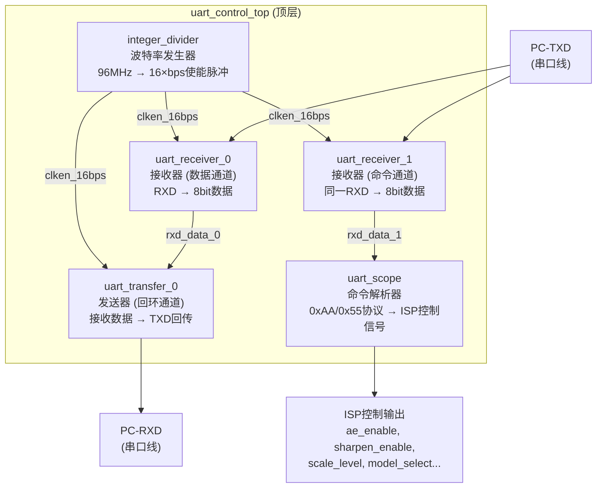
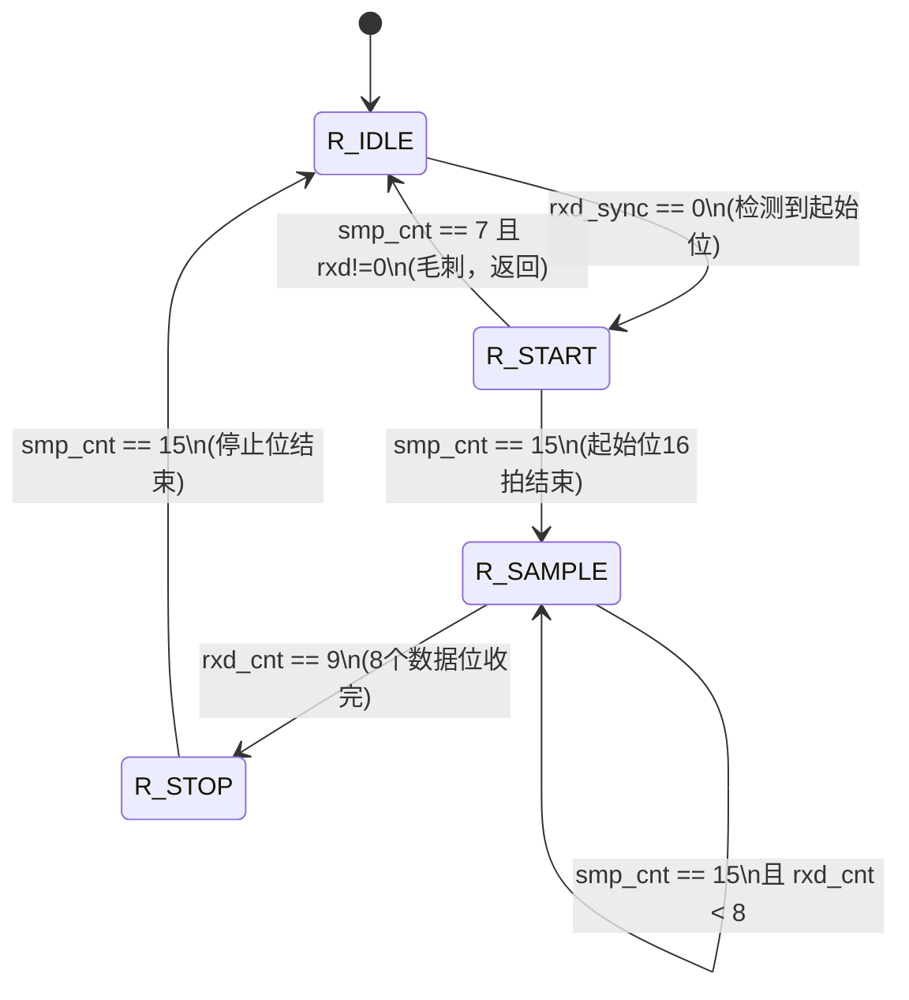
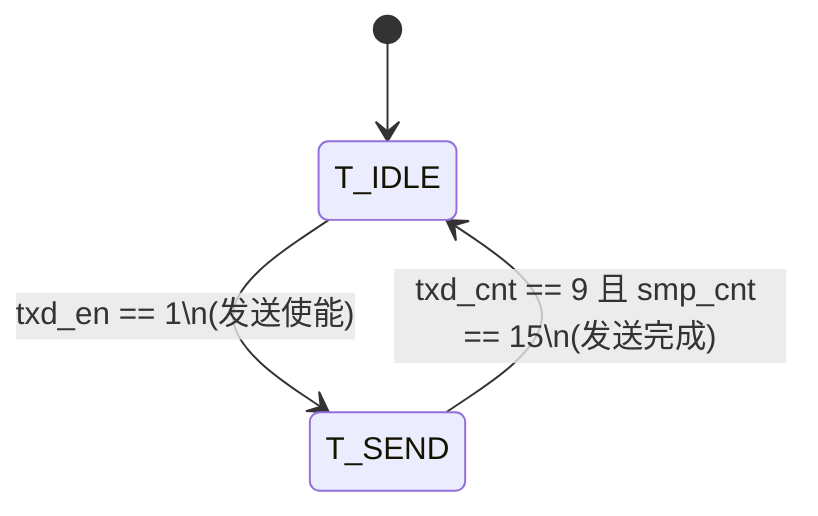

# UART 串口控制模块详解

本文档对项目中 UART 串口通信子系统做逐模块解析，涵盖波特率生成、接收器、发送器、命令解析协议和顶层集成架构。

---

## 1. 系统架构总览



**数据流分两条路径**：
- **回环通道**：PC 发送的数据经 `receiver_0` 接收后，立即通过 `transmitter_0` 原样发回 PC，用于验证通信链路正常
- **命令通道**：同一个 RXD 信号同时接入 `receiver_1`，接收到的字节送给 `uart_scope` 解析为 ISP 控制命令

---

## 2. integer_divider —— 波特率发生器

项目路径：[src/data_in_uart/integer_divider.v](src/data_in_uart/integer_divider.v)

### 2.1 产生的是使能脉冲，不是分频时钟

```verilog
// 96MHz 时钟下，每 52 个周期产生一个单周期脉冲
// => 脉冲频率 = 96MHz / 52 = 1.846MHz
// => 正好是 115200 × 16 (16倍过采样)
parameter DEVIDE_CNT = 52;   // 115200bps × 16
```

| 波特率 | DEVIDE_CNT | 计算公式 |
|--------|-----------|---------|
| 460800 | 13 | 96MHz / 460800 / 16 = 13.02 ≈ 13 |
| 115200 | 52 | 96MHz / 115200 / 16 = 52.08 ≈ 52 |
| 9600 | 625 | 96MHz / 9600 / 16 = 625 |

### 2.2 为什么不用分频时钟

面试高频问题。用使能脉冲而非分频时钟有三大原因：

1. **全局时钟网络**：FPGA 的时钟走专用全局布线资源，逻辑生成的时钟（gated clock）走普通布线，skew 不可控，STA 分析困难
2. **时钟域数量**：每个分频时钟都是一个新时钟域，带来额外的 CDC 问题
3. **低功耗**：使能脉冲方案中，所有寄存器仍由同一个高速时钟驱动，只有使能有效的那一拍才翻转数据路径，其他拍静止

```verilog
// 正确做法：使能脉冲
always @(posedge clk)
    if (clken_16bps)       // 仅在脉冲有效的1拍工作
        smp_cnt <= smp_cnt + 1;

// 错误做法：分频时钟（面试中不要这样写）
always @(posedge clk_div)  // 逻辑生成的时钟，STA噩梦
    smp_cnt <= smp_cnt + 1;
```

### 2.3 代码实现

```verilog
module integer_divider #(
    parameter DEVIDE_CNT = 16'd651  // 9600bps × 16
)(
    input  clk, rst_n,
    output divide_clken
);
    reg [31:0] cnt;
    always @(posedge clk or negedge rst_n)
        if (!rst_n)
            cnt <= 0;
        else
            cnt <= (cnt < DEVIDE_CNT - 1) ? cnt + 1 : 0;

    assign divide_clken = (cnt == DEVIDE_CNT - 1) ? 1'b1 : 1'b0;
endmodule
```

**时序**：

```
clk (96MHz)    : _/‾\_/‾\_/‾\_/‾\ .... _/‾\_/‾\_/‾\_/‾\_
cnt            :  0  1  2  3  ....  50 51  0  1  2  3  ...
divide_clken   : ___________________/‾\__________________/‾\__
                   (每 52 个周期一个脉冲)
```

---

## 3. uart_receiver —— 接收器

项目路径：[src/data_in_uart/uart_receiver.v](src/data_in_uart/uart_receiver.v)

### 3.1 状态机总览



### 3.2 两层计数器架构

接收器内部有两层计数器，需要理解它们的嵌套关系：

| 计数器 | 位宽 | 范围 | 含义 |
|--------|------|------|------|
| `smp_cnt` | 4bit | 0–15 | 每个 bit 内的过采样计数器（16 倍过采样） |
| `rxd_cnt` | 4bit | 0–9 | 当前正在处理第几个 bit（0=起始位, 1–8=数据位, 9=停止位） |

**嵌套逻辑**：`smp_cnt` 从 0 数到 15 完成一个 bit 周期，然后 `rxd_cnt` 加 1 开始下一个 bit 的采样。相当于 `rxd_cnt` 是"bit 级"指针，`smp_cnt` 是"亚 bit 级"指针。

### 3.3 16 倍过采样与中心点采样

```
一个 bit 时长 = 16 个系统时钟周期 (clken_16bps 在 smp_cnt=15 时发脉冲)

    起始位           bit0           bit1            ...
  |<-- 16拍 -->|<-- 16拍 -->|<-- 16拍 -->|
  ┐            ┐            ┐            ┐
  │ 0 1 ... 15 │ 0 1 ... 15 │ 0 1 ... 15 │
  ┘            ┘            ┘            ┘
       ↑   ↑        ↑   ↑        ↑   ↑
       7   15       7   15       7   15
       │            │            │
    毛刺检测     采样点(中心)  采样点(中心)
```

**在 SMP_CENTER（第 7 拍，即 bit 正中央）采样**，有三个好处：

1. **避开跳变沿**：bit 边界在 smp_cnt=0 附近，smp_cnt=7 是离前后跳变沿最远的位置，数据最稳定
2. **毛刺滤波**：状态机在 R_START 状态中，`smp_cnt=7` 时额外检查 `rxd_sync != 0`（即起始位是否仍为低），如果不是就判定为毛刺，直接回 R_IDLE
3. **容忍时钟偏差**：16 倍过采样意味着接收方时钟和发送方时钟可以有约 ±5% 的偏差而不影响正确采样

### 3.4 接收状态机完整代码解析

**R_IDLE —— 空闲等待**：
```verilog
R_IDLE: begin
    rxd_cnt <= 0;
    smp_cnt <= 0;
    if (rxd_sync == 1'b0)    // 检测到低电平 = 起始位
        rxd_state <= R_START; // 进入起始位确认
    else
        rxd_state <= R_IDLE;  // 继续空闲
end
```

**R_START —— 起始位确认（含毛刺过滤）**：
```verilog
R_START: begin
    if (clken_16bps == 1) begin
        smp_cnt <= smp_cnt + 1'b1;
        if (smp_cnt == SMP_CENTER && rxd_sync != 1'b0)
            // 中心点处 rxd 已经恢复高 → 是个毛刺，返回 IDLE
            rxd_state <= R_IDLE;
        else if (smp_cnt == SMP_TOP)
            // 16 拍结束，起始位确认有效，开始收数据
            rxd_state <= R_SAMPLE;
    end
end
```

**R_SAMPLE —— 8 个数据位采样**：
```verilog
R_SAMPLE: begin
    if (clken_16bps == 1) begin
        smp_cnt <= smp_cnt + 1'b1;
        if (smp_cnt == SMP_TOP) begin
            if (rxd_cnt < 4'd8)
                rxd_cnt <= rxd_cnt + 1'b1;  // 下一个数据位
            else
                rxd_state <= R_STOP;         // 8 位收完，去停止位
        end
    end
end
```

**R_STOP —— 停止位**：
```verilog
R_STOP: begin
    if (clken_16bps == 1) begin
        smp_cnt <= smp_cnt + 1'b1;
        if (smp_cnt == SMP_TOP)
            rxd_state <= R_IDLE;   // 一帧收完
    end
end
```

### 3.5 数据采样与输出

```verilog
// 在中心点采样 8 个数据位
if (rxd_state == R_SAMPLE)
    if (clken_16bps == 1 && smp_cnt == SMP_CENTER)
        case (rxd_cnt)
            4'd1: rxd_data_r[0] <= rxd_sync;   // LSB 先收
            4'd2: rxd_data_r[1] <= rxd_sync;
            // ...
            4'd8: rxd_data_r[7] <= rxd_sync;   // MSB 最后
        endcase

// 停止位结束时输出完整字节
if (clken_16bps == 1 && rxd_cnt == 4'd9 && smp_cnt == SMP_TOP) begin
    rxd_data <= rxd_data_r;    // 锁存最终数据
    rxd_flag <= 1;             // 拉起接收完成标志（持续1拍）
end
```

**关键**：`rxd_flag` 只在停止位结束的那一拍为 1，其余所有时刻为 0。这是一个**单周期脉冲**，上层模块用 `if (rxd_flag)` 就能准确捕获每个接收字节。

### 3.6 rxd_sync —— 输入同步

```verilog
reg rxd_sync;
always @(posedge clk or negedge rst_n)
    if (!rst_n)   rxd_sync <= 1;
    else          rxd_sync <= rxd;
```

`rxd` 是来自 FPGA 外部引脚的异步信号。打一拍同步到本地时钟域，避免亚稳态。所有后续逻辑只使用 `rxd_sync` 而不用 `rxd`。

---

## 4. uart_transfer —— 发送器

项目路径：[src/data_in_uart/uart_transfer.v](src/data_in_uart/uart_transfer.v)

### 4.1 发送状态机

只分两个状态，结构极简：



### 4.2 时序控制

```
T_IDLE:  等待 txd_en 拉高
T_SEND:  依次发送 10 个 bit（起始位 + 8数据位 + 停止位）
         每个 bit 占 16 拍（与接收器共用同一个 clken_16bps）
```

### 4.3 输出数据组帧（组合逻辑）

```verilog
always @(*)
    if (txd_state == T_SEND)
        case (txd_cnt)
            4'd0:   txd = 0;              // 起始位 (低)
            4'd1:   txd = txd_data[0];    // LSB
            4'd2:   txd = txd_data[1];
            4'd3:   txd = txd_data[2];
            4'd4:   txd = txd_data[3];
            4'd5:   txd = txd_data[4];
            4'd6:   txd = txd_data[5];
            4'd7:   txd = txd_data[6];
            4'd8:   txd = txd_data[7];    // MSB
            4'd9:   txd = 1;              // 停止位 (高)
            default: txd = 1;              // 空闲状态保持高
        endcase
    else
        txd = 1'b1;  // 空闲状态 txd = 高
```

**面试注意**：这是用 `always @(*)` 组合逻辑实现的输出——每个 `txd_cnt` 值直接映射到一个 bit，无延迟。与接收器的采样逻辑对称。

### 4.4 发送完成标志

```verilog
// txd_flag 在最后一个 bit（停止位）结束时拉高一拍
else if (clken_16bps == 1 && txd_cnt == 4'd9 && smp_cnt == SMP_TOP)
    txd_flag <= 1;
else
    txd_flag <= 0;
```

与接收器的 `rxd_flag` 完全对称——都是单周期脉冲。

---

## 5. uart_scope —— 命令解析器

项目路径：[src/data_in_uart/uart_scope.v](src/data_in_uart/uart_scope.v)

### 5.1 协议格式

```
|  Header0  |  Header1  |  Command   |   Data    |
|   0xAA    |   0x55    |  1 Byte    |  1 Byte   |
|  170      |   85      |  见下表    |  参数值   |
```

使用双字节报头 `0xAA 0x55` 的原因：
- 单独的 `0xAA`（10101010）和 `0x55`（01010101）在波形上分别是交替的高低电平，连续接收两个不同 pattern 可以几乎 100% 排除噪声误触发
- `0xAA` 和 `0x55` 互为按位取反，自相关性极低，误同步概率极小

### 5.2 命令表

| 命令码 | 功能 | 数据位含义 |
|--------|------|-----------|
| `0xCF` | AE 算法控制 | `data[0]` → `ae_enable` |
| `0x3F` | 颜色校正控制 | `data[0]` → `color_correction_enable` |
| `0xAF` | 中值滤波控制 | `data[0]` → `median_filter_enable` |
| `0x9F` | 消光算法控制 | `data[0]` → `extinction_enable` |
| `0x5F` | 锐化控制 | `data[0]` → `sharpen_enable` |
| `0xDF` | 滤波模式选择 | `data[1:0]` → `model_select` |
| `0x6F` | 缩放等级 | `data[7:0]` → `scale_level` (0-100) |
| `0xBF` | 恢复默认 | 所有参数复位到默认值 |

### 5.3 状态机逻辑

```verilog
// 状态 0：等待第一个报头 0xAA
if (rx_data_cnt == 4'd0 && uart_rx_flag)
    if (uart_rx_data == 8'd170)    // 0xAA 匹配
        rx_data_cnt <= 4'd1;        // 进入下一状态
    else
        rx_data_cnt <= 4'd0;        // 不匹配，重新等待

// 状态 1：等待第二个报头 0x55
else if (rx_data_cnt == 4'd1 && uart_rx_flag)
    if (uart_rx_data == 8'd85)    // 0x55 匹配
        rx_data_cnt <= 4'd2;        // 进入命令接收
    else
        rx_data_cnt <= 4'd0;        // 不匹配，回退

// 状态 2：解析命令码，跳转到对应处理状态
else if (rx_data_cnt == 4'd2 && uart_rx_flag)
    case (uart_rx_data)
        8'hCF: rx_data_cnt <= 4'd3;   // → AE 控制
        8'h3F: rx_data_cnt <= 4'd4;   // → 颜色校正控制
        8'hAF: rx_data_cnt <= 4'd6;   // → 中值滤波控制
        8'h9F: rx_data_cnt <= 4'd8;   // → 消光控制
        8'h5F: rx_data_cnt <= 4'd10;  // → 锐化控制
        8'h6F: rx_data_cnt <= 4'd12;  // → 缩放控制
        8'hDF: rx_data_cnt <= 4'd13;  // → 滤波模式控制
        8'hBF: rx_data_cnt <= 4'd14;  // → 恢复默认
        default: rx_data_cnt <= 4'd0; // 无效命令
    endcase

// 各命令处理状态（以 AE 控制为例）
else if (rx_data_cnt == 4'd3 && uart_rx_flag) begin
    ae_enable <= uart_rx_data[0];  // 应用数据
    rx_data_cnt <= 4'd0;            // 回到报头等待
end
```

### 5.4 默认值

所有 ISP 算法默认使能（`=1'b1`），缩放等级默认 50：

```verilog
ae_enable               <= 1'b1;   // AE 默认开
color_correction_enable <= 1'b1;   // 颜色校正默认开
median_filter_enable    <= 1'b1;   // 中值滤波默认开
extinction_enable       <= 1'b1;   // 消光默认开
sharpen_enable          <= 1'b1;   // 锐化默认开
model_select            <= 2'b00;  // 滤波模式 = 0
scale_level             <= 8'd50;  // 缩放 = 50%
```

### 5.5 典型命令示例

| 操作 | 发送字节序列 | 说明 |
|------|-------------|------|
| 关闭 AE | `AA 55 CF 00` | 命令码 CF + 数据 0 |
| 开启锐化 | `AA 55 5F 01` | 命令码 5F + 数据 1 |
| 缩放至 80% | `AA 55 6F 50` | 命令码 6F + 数据 0x50=80 |
| 改滤波模式为 2 | `AA 55 DF 02` | 命令码 DF + 数据 2 |
| 恢复默认 | `AA 55 BF 00` | 命令码 BF + 任意数据 |

---

## 6. uart_control_top —— 顶层集成

项目路径：[src/data_in_uart/uart_control_top.v](src/data_in_uart/uart_control_top.v)

### 6.1 双接收器并行架构（设计亮点）

```verilog
// 同一个 RXD 引脚同时接入两个接收器
uart_receiver u_uart_receiver_0 (  // 数据通道
    .clk(clk_ref), .rst_n(sys_rst_n),
    .clken_16bps(clken_16bps),
    .rxd(fpga_rxd_0),              // ← 同一个 RXD
    .rxd_data(rxd_data_0), .rxd_flag(rxd_flag_0)
);
uart_receiver u_uart_receiver_1 (  // 命令通道
    .clk(clk_ref), .rst_n(sys_rst_n),
    .clken_16bps(clken_16bps),
    .rxd(fpga_rxd_0),              // ← 同一个 RXD
    .rxd_data(rxd_data_1), .rxd_flag(rxd_flag_1)
);
```

为什么不共用一个 receiver？因为两条数据路径的**目标不同**：
- `rxd_data_0` → 立即回环发送（`txd_en = rxd_flag_0`）
- `rxd_data_1` → 送入命令解析器（`uart_scope`）

如果共用，receiver 只有一个 `rxd_flag` 输出，无法同时驱动回环和命令两个通路。

### 6.2 回环测试

```verilog
// transmitter 的发送使能直接连 receiver 的接收完成
// 效果：PC 发什么，FPGA 就回什么
uart_transfer u_uart_transfer_0 (
    .clk(clk_ref), .rst_n(sys_rst_n),
    .clken_16bps(clken_16bps),
    .txd(fpga_txd_0),
    .txd_en(rxd_flag_0),      // 收到一个字节 → 立即发送
    .txd_data(rxd_data_0),    // 发送内容 = 接收内容
    .txd_flag()
);
```

这是调试时的标准做法——PC 端发送任意数据，检查回环是否一致，就能验证 UART 链路是否正常工作。同时命令通道仍然独立工作，不受回环影响。

### 6.3 跨模块同步

所有模块（divider、2个receiver、1个transmitter、scope）共享：
- 同一个 96MHz 时钟：`clk_ref = sys_clk_96M`
- 同一个复位：`sys_rst_n`
- 同一个波特率使能脉冲：`clken_16bps`

这是同步设计的最佳实践——所有逻辑在同一个时钟域，无 CDC 问题。

### 6.4 配置方式修改

```verilog
// 当前使用 115200bps
.DEVIDE_CNT (52)   // 115200bps × 16

// 需要换波特率时，修改参数并重新综合即可：
// .DEVIDE_CNT (13)   // 460800bps × 16
// .DEVIDE_CNT (625)  // 9600bps × 16
```

---

## 7. 面试要点总结

| 问题 | 答案要点 |
|------|---------|
| UART 帧格式 | 空闲高 → 1bit起始(低) → 8bit数据(LSB先) → 1bit停止(高)，本项目 115200-8-N-1 |
| 为什么用 16 倍过采样 | bit 中心点采样最稳定 + 毛刺过滤 + 可容忍 ±5% 时钟偏差 |
| 用分频时钟还是使能脉冲 | 必须是使能脉冲！分频时钟引入新时钟域，STA 难收敛 |
| 双 receiver 并行的原因 | 回环数据通道和命令解析通道独立工作，互不干扰 |
| 命令协议防误触发 | 双报头 0xAA/0x55 互逆，自相关极低，几乎不可能被噪声误触发 |
| 如何验证 UART 链路 | 回环测试：PC 发 → FPGA 收 → 立即原样发回 PC，PC 对比收发是否一致 |
| 接收器的亚稳态处理 | `rxd` 打一拍成 `rxd_sync` 后再使用 |
| `rxd_flag` 持续多久 | 单周期脉冲（停止位结束的那一拍），其余时间全为 0 |
